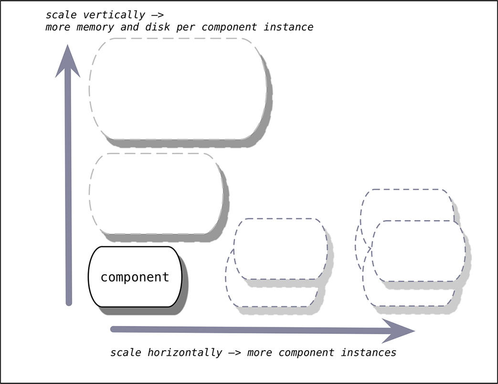

##零停机部署与扩展

为了提高Cloud Foundry平台的容量及可用性，并且尽可能的减少停机的可能性，你可以使用以下策略来部署你的应用程序。

这个主题同样也描述了零停机部署的需求。零停机部署保证了如果某个组件停了，你的部署可以继续进行下去。

###零停机部署

此章节描述了如果配置零停机部署。

####应用程序实例

至少部署两个应用程序的实例。

####组件

扩展你的组件如在提高平台可用性章节提高的那样。组件应该被分配到至少两个以上的区域(AZs)。

####空间

保证你分配并维护足够的以下资源：

* 空闲空间保证程序能够在DEAs上成功的打包部署并运行。
* 如果DEAs的最大并行安装作业数失败了，适当的部署磁盘空间和内存能够保证程序的所有实例能够在剩下的DEAs执行。
* 空闲空间来处理如果部署在多个可用空间里某个空间停机了。

####资源池

根据你部署的需求来配置你的[资源池](http://www.google.com/url?q=http%3A%2F%2Fdocs.cloudfoundry.org%2Fbosh%2Fdeployment-basics.html%23resource-pools&sa=D&sntz=1&usg=AFQjCNEyabXy-ymhPvBarCYQP8ZfIeL7pA)。

###扩展平台容量

你可以通过增加内存和磁盘大小来纵向扩展平台容量，或者你可以增加运行Cloud Foundry组件的虚拟机数量来横向扩展。

####权衡与优点

根据具体应用程序的本质来决定使用纵向还是横向扩展。

####DEAs:

最理想的大小和CPU/内存权衡取决于运行在DEA上应用程序的性能特性能。

* The more DEAs are horizontally scaled, the higher the number of NATS messages the DEAs generate. There are no known limits to the number of DEA nodes in a platform.
* The denser the DEAs (the more vertically scaled they are), the larger the NATS message volume per DEA, as each message includes details of each app instance running on the DEA.
* Larger DEAs also make for larger points of failure: the system takes longer to rebalance 100 app instances than to rebalance 20 app instances.

####路由:

Scale the router with the number of incoming requests. In general, this load is much less than the load on DEA nodes.

####健康管理:

The Health Manager works as a failover set, meaning that only one Health Manager is active at a time. For this reason, you only need to scale the Health Manager to deal with instance failures, not increased deployment size.

####Cloud Controller:

Scale the Cloud Controller with the number of requests to the API and with the number of apps in the system.

###Scaling Platform Availability
To scale the Cloud Foundry platform for high availability, the actions you take fall into three categories.

For components that support multiple instances, increase the number of instances to achieve redundancy.
For components that do not support multiple instances, choose a strategy for dealing with events that degrade availability.
For database services, plan for and configure backup and restore where possible.
Note: Data services may have single points of failure depending on their configuration.

####Scalable Processes
You can think of components that support multiple instances as scalable processes. If you are already scaling the number of instances of such components to increase platform capacity, you need to scale further to achieve the redundancy required for high availability.

Component	Number	Notes
Load Balancer	1	
NATS Server	≥ 2	If you lack the network bandwidth, CPU utilization, or other resources to deploy two stable NATS servers, Pivotal recommends that you use one NATS server.
HM9000	≥ 2	
Cloud Controller	≥ 2	More Cloud Controllers help with API request volume.
Gorouter	≥ 2	Additional Gorouters help bring more available bandwidth to ingress and egress.
Collector	1	
UAA	≥ 2	
DEA	≥ 3	More DEAs add application capacity.
Doppler Server (formerly Loggregator Server)	≥ 2	Deploying additional Doppler servers splits traffic across them.
Loggregator Traffic Controller	≥ 2	Deploying additional Loggregator Traffic Controllers allows you to direct traffic to them in a round-robin manner.
####Single-node Processes
You can think of components that do not support multiple instances as single-node processes. Since you cannot increase the number of instances of these components, you should choose a different strategy for dealing with events that degrade availability.

First, consider the components whose availability affects the platform as a whole.

####HAProxy:

Cloud Foundry deploys with a single instance of HAProxy for use in lab and test environments. Production environments should use your own highly-available load balancing solution.

####NATS:

You might run NATS as a single-node process if you lack the resources to deploy two stable NATS servers.

Cloud Foundry continues to run any apps that are already running even when NATS is unavailable for short periods of time. The components publishing messages to and consuming messages from NATS are resilient to NATS failures. As soon as NATS recovers, operations such as health management and router updates resume and the whole Cloud Foundry system recovers.

Because NATS is deployed by BOSH, the BOSH resurrector will recover the VM if it becomes non-responsive.

####NFS Server:

For some deployments, an appropriate strategy would be to use your infrastructure’s high availability features to immediately recover the VM where the NFS Server runs. In others, it would be preferable to run a scalable and redundant blobstore service. Contact Pivotal PSO if you need help.

####SAML Login Server:

Because the Login Server is deployed by BOSH, the BOSH resurrector will recover the VM if it becomes non-responsive.

Secondly, there are components whose availability does not affect that of the platform as a whole. For these, recovery by normal IT procedures should be sufficient even in a high availability Cloud Foundry deployment.

####Syslog:

An event that degrades availability of the Syslog VM causes a gap in logging, but otherwise Cloud Foundry continues to operate normally.

Because Syslog is deployed by BOSH, the BOSH resurrector will recover the VM if it becomes non-responsive.

####Collector:

This component is not in the critical path for any operation.

Compilation:

This component is active only during platform installation and upgrades.

####Etcd:

Etcd is a highly-available key value store used for shared configuration and service discovery. More information on running etcd on single node is available here

###Databases
For database services deployed outside Cloud Foundry, plan to leverage your infrastructure’s high availability features and to configure backup and restore where possible.

Contact Pivotal PSO if you require replicated databases or any assistance.