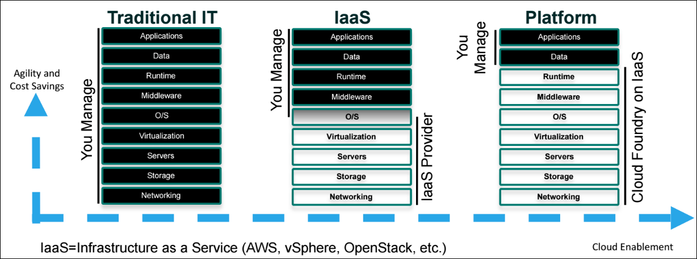

<!--
Cloud Foundry Overview
Page last updated: December 7, 2016
-->
##Cloud Foundry概述

最后更新: 2016-12-7

<!--
###The Industry-Standard Cloud Platform
-->
###行业标准云平台

<!--
Cloud platforms let anyone deploy network apps or services and make them available to the world in a few minutes. When an app becomes popular, the cloud easily scales it to handle more traffic, replacing with a few keystrokes the build-out and migration efforts that once took months. Cloud platforms represent the next step in the evolution of IT, enabling you to focus exclusively on your applications and data without worrying about underlying infrastructure.
-->
云平台能够让任何人在几分钟之内就可以部署网络应用程序或者服务。当某个应用变得热门时，云平台能够轻松的扩容来应对更多的流量，以前需要数月才能完成的构建和迁移现在只需要简单的敲几下键盘就完成了。云平台代表了下一代IT革命，让你专门关注你的应用程序和数据而不用担心底层基础设施。

<!--
Not all cloud platforms are created equal. Some have limited language and framework support, lack key app services, or restrict deployment to a single cloud. Cloud Foundry (CF) has become the industry standard. It is an [open source] platform that you can deploy to run your apps on your own computing infrastructure, or deploy on an IaaS like AWS, vSphere, or OpenStack. You can also use a PaaS deployed by a commercial [CF cloud provider]. A broad [community] contributes to and supports Cloud Foundry. The platform’s openness and extensibility prevent its users from being locked into a single framework, set of app services, or cloud.
-->
云平台功能各异。某些只支持部分语言和框架，缺少主要的服务，或者只能部署到某个云服务。Cloud Foundry(CF)已成为行业标准。它是一个完全[开源]的平台，你可以使用你自己的计算基础设施部署你的应用，或者使用IaaS服务例如AWS、vSphere或者OpenStack。你也可以使用现成的PaaS商业版的[CF云提供商]。庞大的[社区]持续的贡献与支持Cloud Foundry。平台的公开性以及扩展性有效的防止了用户被限制在某个框架、某些应用服务或者云服务。

<!--
Cloud Foundry is ideal for anyone interested in removing the cost and complexity of configuring infrastructure for their apps. Developers can deploy their apps to Cloud Foundry using their existing tools and with zero modification to their code.
-->
Cloud Foundry是任何人想减少配置他们应用程序基础设施成本和复杂度较理想的工具。开发人员甚至可以使用他们已有的工具并且不用修改任何代码的情况下在Cloud Foundry部署他们的应用程序。

<!--
###How Cloud Foundry Works
-->
###Cloud Foundry如何工作

<!--
To flexibly serve and scale apps online, Cloud Foundry has subsystems that perform specialized functions. Here’s how some of these main subsystems work.
-->
为了灵活的服务和扩容先上的应用程序，Cloud Foundry有许多子系统用来完成特定的功能。以下介绍了几个主要的子系统的工作原理。

<!--
####How the Cloud Balances Its Load
-->
####Cloud Balances均衡负载

<!--
Clouds balance their processing loads over multiple machines, optimizing for efficiency and resilience against point failure. A Cloud Foundry installation accomplishes this at three levels:
-->
云平台在多台机器之间实现均衡负载，规避了单点故障并提高了效率和可靠性。安装Cloud Foundry完成了以下三个层面：

<!--
1. [BOSH] creates and deploys virtual machines (VMs) on top of a physical computing infrastructure, and deploys and runs Cloud Foundry on top of this cloud. To configure the deployment, BOSH follows a manifest document.
2. The CF [Cloud Controller] runs the apps and other processes on the cloud’s VMs, balancing demand and managing app lifecycles.
3. The [router] routes incoming traffic from the world to the VMs that are running the apps that the traffic demands, usually working with a customer-provided load balancer.
-->
1. [BOSH]在物理计算基础设施上创建和部署虚拟机(VMs)，并在此之上部署和运行Cloud Foundry。为了配置部署，BOSH遵循既定的清单文档。
2. CF[控制器]在云虚拟机上运行和处理应用程序，按需负载以及管理应用程序生命周期。
3. [路由]外部传入流量到内部虚拟机，虚拟机按流量需求运行应用程序，通常
与客户提供的均衡服务器协同运行。

<!--
####How Apps Run Anywhere
-->
####程序如何能够到处运行

<!--
Cloud Foundry designates two types of VMs: the component VMs that constitute the platform’s infrastructure, and the host VMs that host apps for the outside world. Within CF, the Diego system distributes the hosted app load over all of the host VMs, and keeps it running and balanced through demand surges, outages, or other changes. Diego accomplishes this through an auction algorithm.
-->
Cloud Foundry制定了两种类型的虚拟机: 平台基础设施提供的组件式虚拟机，还有外部提供用于托管应用程序的托管虚拟机。CF内部，Diego系统在托管虚拟机上按需分发托管程序，保持持续运行并在需求激增、运行中断或其他变动时进行平衡。Diego通过一个竞争算法完成这项工作。

<!--
To meet demand, multiple host VMs run duplicate instances of the same app. This means that apps must be portable. Cloud Foundry distributes app source code to VMs with everything the VMs need to compile and run the apps locally. This includes the OS [stack] that the app runs on, and a [buildpack] containing all languages, libraries, and services that the app uses. Before sending an app to a VM, the Cloud Controller [stages] it for delivery by combining stack, buildpack, and source code into a droplet that the VM can unpack, compile, and run. For simple, standalone apps with no dynamic pointers, the droplet can contain a pre-compiled executable instead of source code, language, and libraries.
-->
为了满足需求，多个托管虚拟机都运行着应用程序的重复实例。这就意味着这些应用程序必须是可移植的。Cloud Foundry将应用程序的源代码及所需依赖分发到制定虚拟机并在本地编译和运行应用程序。这个过程包括运行应用程序的[操作系统栈]，包含所有应用程序所需的语言、类库和服务的[buildpack]。在分发应用程序到虚拟机之前，Cloud控制器会先[暂存]它并和合并栈、buildpack还有源代码打包进droplet, 虚拟机可以将其解压、编译并运行。对于一个独立且没有动态指针的简单程序来说，droplet可以包含一个预编译可执行的程序而非源代码、语言和类库。

<!--
####How CF Organizes Users and Workspaces
-->
####CF如何管理用户与工作区

<!--
To organize user access to the cloud and to control resource use, a cloud operator defines [Orgs and Spaces] within an installation and assigns Roles such as admin, developer, or auditor to each user. The [User Authentication and Authorization] (UAA) server supports access control as an [OAuth2] service, and can store user information internally or connect to external user stores through LDAP or SAML.
-->
为了管理用户访问云和控制使用资源，云操作员在安装时会定义[组织和空间]并给用户分配角色例如管理员、开发者或者审核员。[用户认证和授权](UAA)服务支持访问控制作为一个[OAuth2]服务，可以在其内部存储用户信息或者通过外部LDAP、SAML存储。

<!--
####Where CF Stores Resources
-->
####CF在哪存储资源

<!--
Cloud Foundry uses the git system on [GitHub] to version-control source code, buildpacks, documentation, and other resources. Developers on the platform also use GitHub for their own apps, custom configurations, and other resources. To store large binary files, such as droplets, CF maintains an internal or external blobstore. To store and share temporary information, such as internal component states, CF uses MySQL, [Consul], and [etcd].
-->
Cloud Foundry使用[GitHub]的git系统版本控制源代码、buildpacks、文档和其他资源。平台上的开发人员同样使用GitHub管理他们的应用程序、自定义配置和其他资源。对于大型二进制文件存储，例如droplets，CF维护了一个内部或者外部的blobstore。存储和共享临时信息，例如内部组件状态，CF使用MySQL、[Consul]和[etcd]。

<!--
####How CF Components Communicate
-->
####CF组件如何通信

<!--
Cloud Foundry components communicate with each other by posting messages internally using http and https protocols, and by sending [NATS] messages to each other directly.
-->
Cloud Foundry组件之间内部通信使用http或者https协议，通过发送[NATS]信息直接通信。

<!--
####How to Monitor and Analyze a CF Deployment
-->
####CF如何监控与分析部署

<!--
As the cloud operates, the Cloud Controller VM, router VM, and all VMs running apps continuously generate logs and metrics. The Loggregator system aggregates this information in a structured, usable form, the Firehose. You can use all of the output of the Firehose, or direct the output to specific uses, such as monitoring system internals or analyzing user behavior, by applying nozzles.
-->
由于云操作，控制器虚拟机、路由虚拟机和所有运行着应用程序的虚拟机持续产生的日志和指标。日志收集器以结构化、格式良好及流式收集日志。你可以使用所有日志流输出，或者导出以备特殊用途，例如通过日志管道监控系统内部运行或者分析用户行为。

<!--
####Using Services with CF
-->
####使用CF服务

<!--
Typical apps depend on free or metered [services] such as databases or third-party APIs. To incorporate these into an app, a developer writes a Service Broker, an API that publishes to the Cloud Controller the ability to list service offerings, provision the service, and enable apps to make calls out to it.
-->
典型的应用程序依赖一些免费的或者计费的[服务]例如数据库或者第三方APIs。为了把这些服务与应用程序进行整合，开发人员需要写一个服务代理，一个发布到控制器的服务清单、服务创建和应用程序调用的API。

[开源]: https://github.com/cloudfoundry
[CF云提供商]: https://www.cloudfoundry.org/learn/certified-providers/
[社区]: https://www.cloudfoundry.org/community/
[BOSH]: http://bosh.io/
[控制器]: http://docs.cloudfoundry.org/concepts/architecture/cloud-controller.html
[路由]: http://docs.cloudfoundry.org/concepts/architecture/router.html
[操作系统栈]: http://docs.cloudfoundry.org/devguide/deploy-apps/stacks.html
[buildpack]: http://docs.cloudfoundry.org/buildpacks/
[暂存]: http://docs.cloudfoundry.org/concepts/how-applications-are-staged.html
[组织和空间]: http://docs.cloudfoundry.org/concepts/roles.html
[用户认证和授权]: http://docs.cloudfoundry.org/concepts/architecture/uaa.html
[OAuth2]: http://oauth.io/
[GitHub]: http://github.org/
[Consul]: https://github.com/hashicorp/consul
[etcd]: https://github.com/coreos/etcd
[NATS]: http://docs.cloudfoundry.org/concepts/architecture/messaging-nats.html
[服务]: http://docs.cloudfoundry.org/services/overview.html
